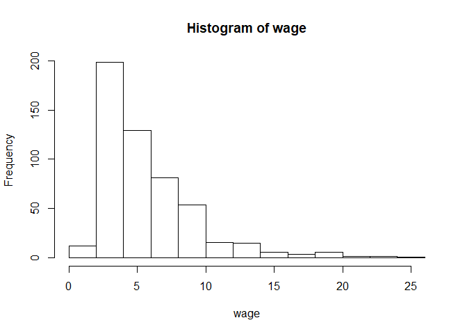
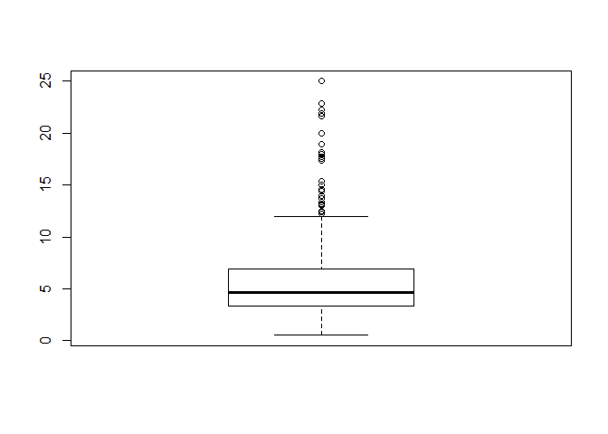
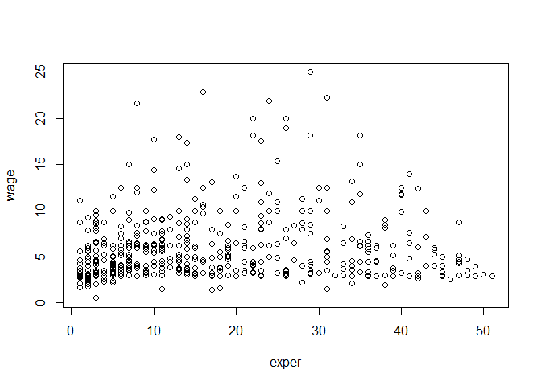

1\. gyakorlat
================
Marcell Granát
2020 11 11

``` r
data(wage1, package = 'wooldridge')
attach(wage1)
```

``` r
mean(wage)
```

    ## [1] 5.896103

``` r
mean(educ)
```

    ## [1] 12.56274

``` r
hist(wage)
```

<!-- -->

``` r
boxplot(wage)
```

<!-- -->

``` r
log_wage <- log(wage)
```

``` r
quantile(wage, probs = c(.1, .9))
```

    ##   10%   90% 
    ##  2.92 10.00

“Legegyszerűbb kapcsolatvizsgálat egy plot”

``` r
plot(exper, wage)
```

<!-- -->

``` r
cor(exper, wage)
```

    ## [1] 0.1129034

Bár az ábrán is látszik, hogy nem lineáris lesz a kapcsolat.

### Bér külön férfiakra és nőkre:

``` r
mean(wage[female == 1])
```

    ## [1] 4.587659

``` r
mean(wage[female == 0])
```

    ## [1] 7.099489

``` r
sd(wage[female == 1])
```

    ## [1] 2.529363

``` r
sd(wage[female == 0])
```

    ## [1] 4.160858

``` r
mean(wage[female == 1])+1.96*sd(wage[female == 1])/sqrt(526)*c(-1, 1)
```

    ## [1] 4.371499 4.803818

``` r
t.test(wage[female == 1], wage[female == 0], mu = 0, paired = F)
```

    ## 
    ##  Welch Two Sample t-test
    ## 
    ## data:  wage[female == 1] and wage[female == 0]
    ## t = -8.44, df = 456.33, p-value = 4.243e-16
    ## alternative hypothesis: true difference in means is not equal to 0
    ## 95 percent confidence interval:
    ##  -3.096690 -1.926971
    ## sample estimates:
    ## mean of x mean of y 
    ##  4.587659  7.099489

``` r
uj_adatok <- data.frame(wage, educ, exper, tenure)
cor(uj_adatok)
```

    ##             wage        educ      exper      tenure
    ## wage   1.0000000  0.40590333  0.1129034  0.34688957
    ## educ   0.4059033  1.00000000 -0.2995418 -0.05617257
    ## exper  0.1129034 -0.29954184  1.0000000  0.49929145
    ## tenure 0.3468896 -0.05617257  0.4992914  1.00000000

``` r
data(bwght, package = "wooldridge")
attach(bwght)
```

    ## The following object is masked _by_ .GlobalEnv:
    ## 
    ##     bwght
